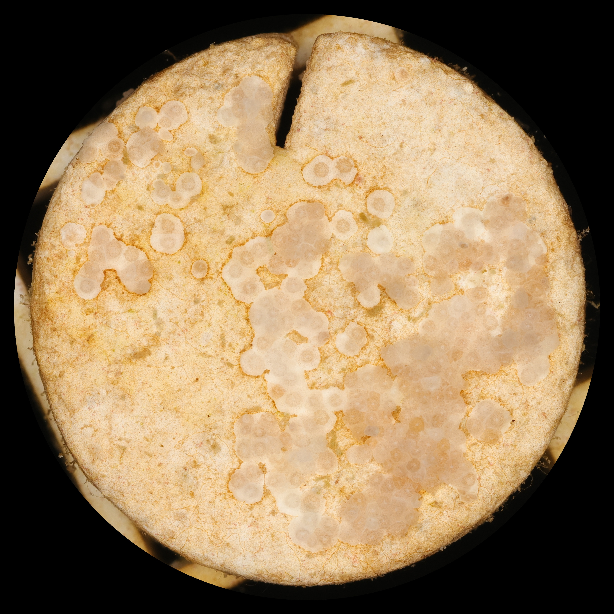
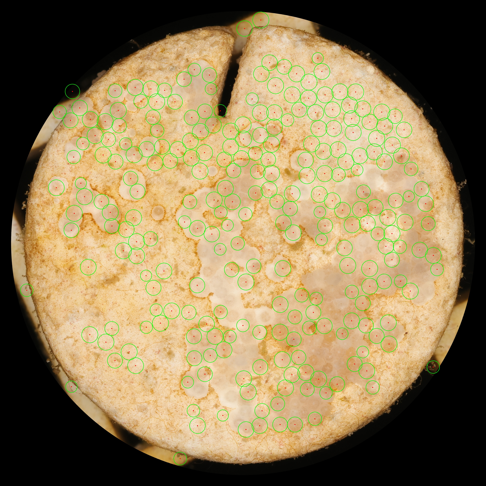
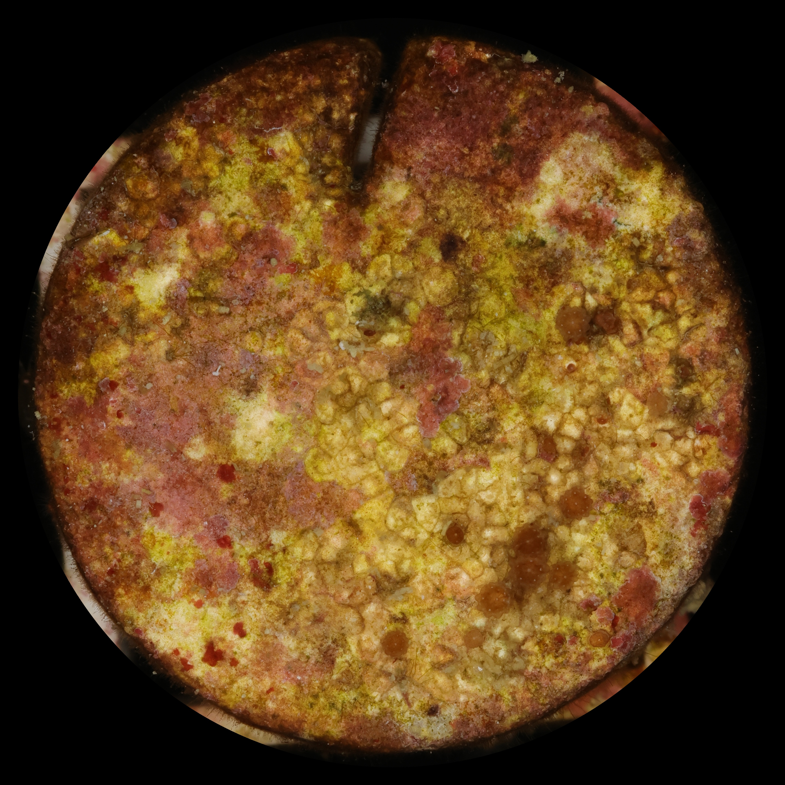
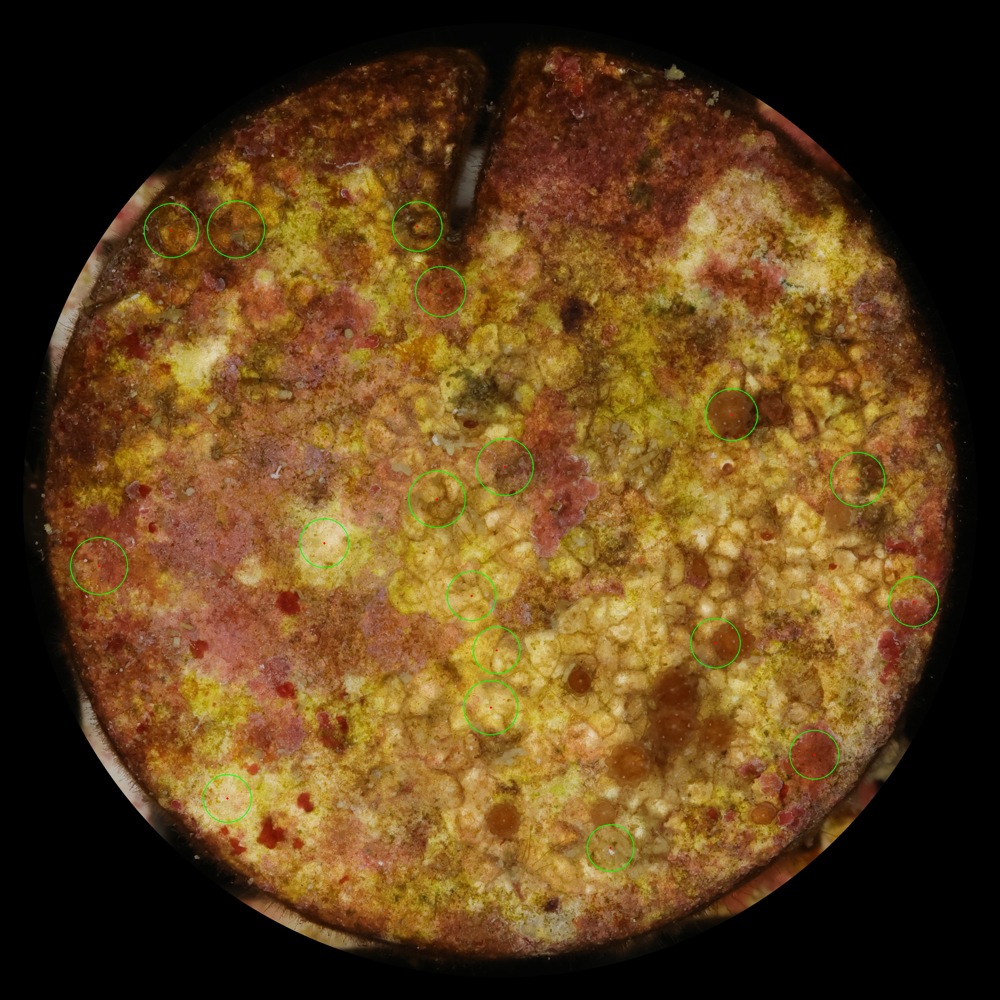

# Coral Larvae Detection

A classical computer-vision project for detecting coral larvae in sample imagery using image preprocessing, edge detection, region analysis, texture segmentation, and circle detection.

This project was developed collaboratively for a computer vision course at San José State University. The repository has since been cleaned up into a reproducible pipeline while preserving the original exploratory scripts and team history.

## Overview

Detecting coral larvae is challenging because the samples vary in contrast, background appearance, size, and visual texture. The project explored multiple classical computer-vision strategies:

- Gaussian filtering for noise reduction
- Sobel and Canny edge detection
- Intensity thresholding and morphological cleanup
- Connected-component analysis for region filtering
- Hough circle detection for circular larvae candidates
- Law's texture-energy filters with K-Means clustering for texture segmentation

## Example Results

| Input | Detected candidates |
| --- | --- |
|  |  |
|  |  |

A representative texture-segmentation result is available at [`examples/segmentation/segmented_33.5_T1_4_timepoint0.JPG`](examples/segmentation/segmented_33.5_T1_4_timepoint0.JPG).

## Pipeline

```text
Input image
   |
   +--> Gaussian preprocessing
   |
   +--> Sobel / Canny edge analysis
   |
   +--> Thresholding or edge-based region extraction
   |
   +--> Morphological cleanup
   |
   +--> Connected-component filtering
   |
   +--> Hough circle detection
   |
   +--> Annotated coral-larvae candidates
```

The sample set contains two acquisition styles, identified by the original `timepoint0` and `timepoint1` filenames. The cleaned detector uses reusable profiles for those styles rather than duplicating a separate script for each image.

## Tech Stack

**Python**, **OpenCV**, **NumPy**, **scikit-learn**, **Matplotlib**, and **Pillow**

## Repository Structure

```text
.
├── examples/
│   ├── input/              # Representative coral sample images
│   ├── results/            # Curated final detection results
│   └── segmentation/       # Representative texture-segmentation output
├── legacy/                 # Original exploratory scripts preserved for reference
├── src/
│   ├── preprocessing.py
│   ├── edge_detection.py
│   ├── detection.py
│   └── texture_segmentation.py
├── run_pipeline.py         # Reproducible CLI entry point
├── requirements.txt
└── README.md
```

## Setup

Python 3.10+ is recommended.

```bash
git clone https://github.com/SanjanaNagwekar/coral-larvae-detection.git
cd coral-larvae-detection
python -m venv .venv
source .venv/bin/activate        # Windows: .venv\Scripts\activate
pip install -r requirements.txt
```

## Run the Pipeline

```bash
python run_pipeline.py --input examples/input --output outputs
```

Generated stages are written under `outputs/<image-name>/` as Gaussian, Sobel, Canny, region-mask, and detection images.

Texture segmentation is more computationally expensive, so it is optional:

```bash
python run_pipeline.py --input examples/input/33.5_T1_4_timepoint0.JPG --output outputs --with-texture
```

For images outside the original naming convention, explicitly choose a profile if needed:

```bash
python run_pipeline.py --input my_image.jpg --profile timepoint0
python run_pipeline.py --input my_image.jpg --profile timepoint1
```

## Technical Notes

### Preprocessing and edge analysis

Gaussian blur reduces high-frequency noise before Sobel and Canny processing. Sobel computes gradient magnitude from horizontal and vertical derivatives, while Canny provides a sparse edge map useful for visual comparison and region extraction.

### Region filtering and circle detection

The final project explored both intensity-based and edge-based preprocessing. The cleaned detector applies morphological operations, filters connected components by area, masks candidate regions, and then applies the Hough Circle Transform to produce circular candidate detections.

The curated results in `examples/results/` come from the original team project, where parameters were tuned during experimentation. The cleaned CLI provides a reproducible version of that approach using timepoint-level profiles rather than six image-specific scripts.

### Texture segmentation

The texture experiment computes Law's texture-energy responses and clusters the resulting per-pixel feature vectors with K-Means. The cleaned implementation preserves signed filter responses in floating point before computing energy and uses deterministic cluster colors for reproducible visualization.

## My Contributions

This was a collaborative three-person project. My verified contributions in the repository history include:

- Developing the initial Gaussian preprocessing, Sobel edge-detection, and Canny edge-detection implementations.
- Implementing thresholding and contour-based spot detection during the Hough/circle-detection exploration.
- Developing the Law's texture-energy feature extraction and K-Means texture-segmentation pipeline.
- Contributing to experimentation, parameter tuning, and evaluation across the computer-vision workflow.

The final connected-component experiments and image-specific tuning were collaborative work, and the original commit history is preserved for attribution.

## Limitations

This is a classical computer-vision prototype rather than a trained object-detection model. The project does not include hand-labeled ground truth, so the repository does not claim a formal accuracy metric. Detection quality is sensitive to image acquisition conditions and profile parameters.

Potential extensions include building a labeled dataset, measuring precision/recall, replacing hand-tuned thresholds with learned segmentation or detection models, and estimating larval size or developmental stage.

## Contributors

- Anaya Dandekar
- Himavanth Karpurapu
- Sanjana Nagwekar

## Acknowledgments

Developed as a San José State University computer vision course project with guidance from Professor Nada.
